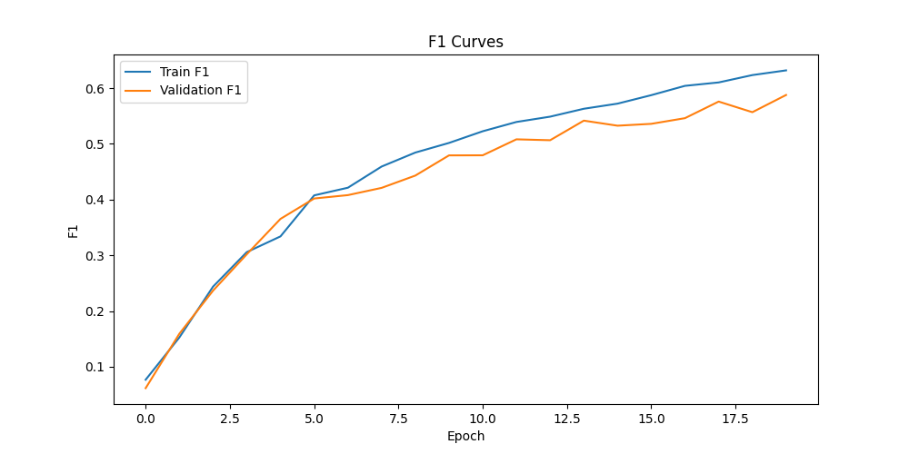
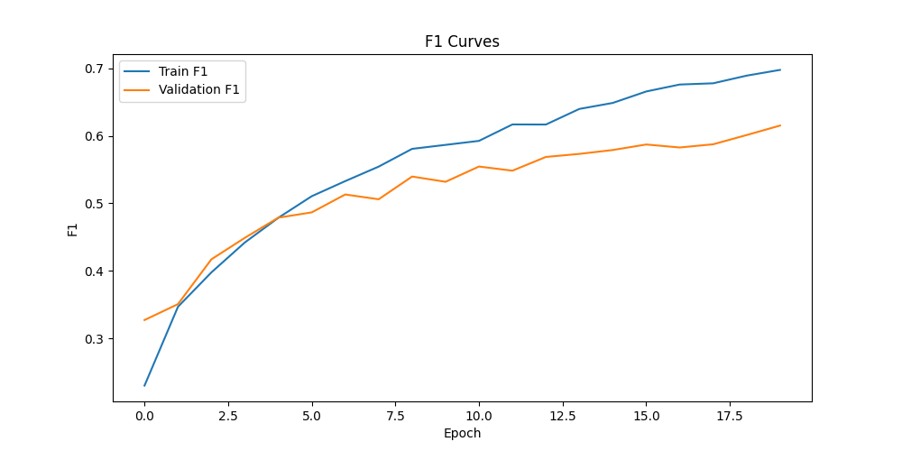
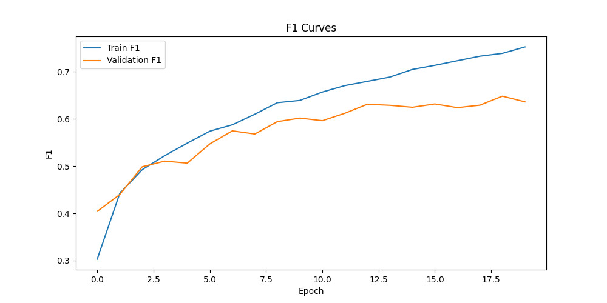
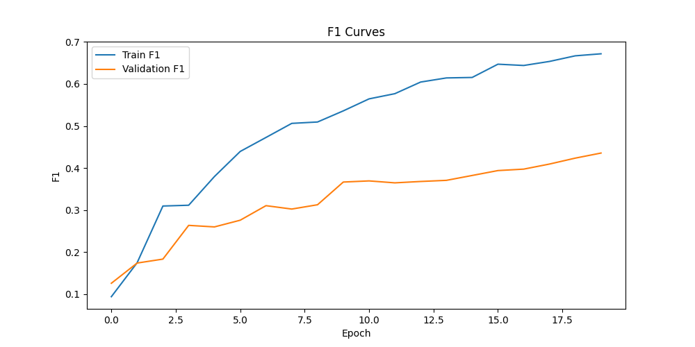

# active_learning

## Датасет

CIFAR-10

## Алгоритмы

| Студент | Группа | Метод | Описание метода | Ссылка на статью |
| --- | --- | --- | --- | --- |
| Гаев Роман | 209М |  Expected Gradient Length (EGL) | Выбор примеров, которые имеют наибольшее влияние на градиент функции потерь. |  https://openreview.net/pdf?id=ryghZJBKPS |
|            |      |  BALD (Bayesian Active Learning by Disagreement) | Учитывает уменьшение энтропии при добавлении нового примера. | https://arxiv.org/pdf/1112.5745 |                        
| Лавренченко Мария | 209М |  Contrastive Active Learning (CAL)   |Выбирает такие контрастирующие между собой примеры, которые наилучшим образом помогают улучшить качество модели. | https://aclanthology.org/2021.emnlp-main.51.pdf|
| Панцырный Иван | 214М | Least Confidence (LC) | Выбор данных с наименьшей уверенностью модели в предсказании. | https://arxiv.org/pdf/cmp-lg/9407020 |
| Орачёв Алексей | 209М | Maximum Normalized Log-Probability (MNLP) | Использование нормализованных логарифмов вероятностей для выбора примеров. | https://aclanthology.org/W17-2630.pdf |

## Результаты

| Алгоритм  | Картинка 1                | Картинка 2                | Картинка 3                |
|-----------|---------------------------|---------------------------|---------------------------|
| No AL |  |   |   |
| EGL |  |  |  |
| BALD |  |  |  |
| Contr |   |  |   |
| LC |   |    |   |
| MNLP |  |   |   |